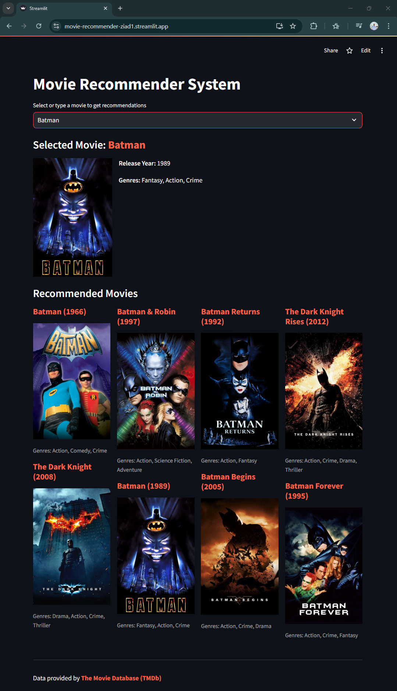

# Movie Recommendation System using Content-Based Filtering

This is a Movie Recommendation System built using Content-Based Filtering. The application takes advantage of the TMDB dataset to provide movie suggestions based on the input movie, giving users a personalized recommendation list. It is built using Python, Streamlit for the user interface, and scikit-learn for Natural Language Processing (NLP).


## Live Demo

Check out the live demo of our Movie Recommendation System:

[Movie Recommender Live Demo](https://movie-recommender-ziad1.streamlit.app/)



## Features

- Content-based movie recommendation
- Interactive web interface using Streamlit
- Integration with TMDB API for fetching movie posters and additional details
- Clickable movie titles linking to IMDb pages
- Display of movie genres and release years
- Live demo available for instant access

## Installation

1. Clone the repository:
   ```
   git clone https://github.com/ziadmostafa1/Movie-Recommendation-System-using-Content-Based-Filtering.git
   cd Movie-Recommendation-System-using-Content-Based-Filtering
   ```

2. Install the required packages:
   ```
   pip install -r requirements.txt
   ```

3. Set up your TMDB API key:
   - Create a file named `.streamlit/secrets.toml` in the project root
   - Add your TMDB API key to this file:
     ```
     tmdb_api_key = "your_api_key_here"
     ```

## Usage

1. Run the Streamlit app locally:
   ```
   streamlit run app.py
   ```

2. Open your web browser and navigate to the URL provided by Streamlit (usually `http://localhost:8501`).

3. Select a movie from the dropdown or type a movie title to get recommendations.

Alternatively, you can use our [live demo](https://movie-recommender-ziad1.streamlit.app/) to try out the recommendation system without any setup.

## Project Structure

- `app.py`: Main Streamlit application file
- `movie_recommendation.ipynb`: Jupyter notebook containing the data preprocessing and model creation steps
- `movielist.pkl`: Pickle file containing the processed movie data
- `cosine_sim.pkl`: Pickle file containing the cosine similarity matrix
- `requirements.txt`: List of Python dependencies
- `data/`: Directory containing the TMDB dataset files

## Data Source

This project uses the TMDB 5000 Movie Dataset. You can download it from [Kaggle.](https://www.kaggle.com/tmdb/tmdb-movie-metadata)


## Acknowledgements

- Data provided by [The Movie Database (TMDb)](https://www.themoviedb.org)
- Project inspired by various online tutorials and courses on recommendation systems
- Hosted on [Streamlit Sharing](https://streamlit.io/sharing)